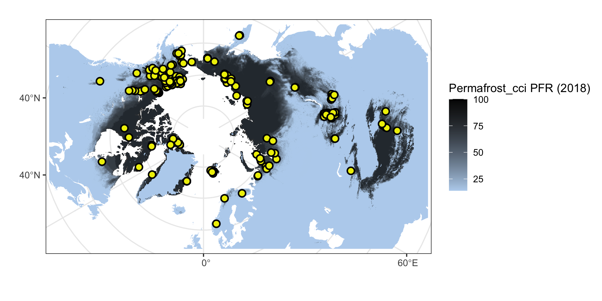

<style type="text/css">
.main-container {
  max-width: 1400px;
  margin-left: auto;
  margin-right: auto;
}
</style>

<details>
  <summary>R Library</summary>
  ```{r libraries, message=FALSE, warning=FALSE,  results=FALSE}
  library(readxl)
  library(ncdf4)
  library(raster)
  library(tidyverse)
  library(ggforce)
  library(grid)
  library(sf)
  sf::sf_use_s2(FALSE)
  ```
</details><br/> 

The in situ dataset:

<details>
  <summary>Dataset compilation</summary>
  ```{r ALT dataset v3, message=FALSE, warning=FALSE,  results=FALSE}
    inSitu_alt <- read.csv("data/ALT_inSitu_v3_2020.csv", sep = ";", dec = ",") %>%
    select(-ALT_Permafrost_cci, -starts_with("X")) %>% mutate(ALT_Permafrost_cci = NA) %>% rename(Year = year) %>%
    filter(!is.na(Latitude), !is.na(Longitude))
  ```
</details>

<details>
  <summary>Figure 4.1 code</summary>
  ```{r figure4.1, message=FALSE, warning=FALSE,  results=FALSE}
  ## base map
    mp <-  st_read("~/Google Drive/My Drive/GeoDat/NaturalEarth/50m_physical/ne_50m_land/ne_50m_land.shp", quiet = TRUE) %>% 
    st_set_crs(4326) %>% st_buffer(0) %>% st_union() %>%
    st_sym_difference(st_read("~/Google Drive/My Drive/GeoDat/NaturalEarth/110m_physical/ne_110m_lakes/ne_110m_lakes.shp", quiet = TRUE) %>% 
    st_set_crs(4326) %>% st_union()) %>%
    st_transform("+proj=stere +lat_0=90 +lat_ts=71 +lon_0=0 +x_0=0 +y_0=0 +datum=WGS84 +units=m +no_defs") %>%
    st_crop(st_bbox(c(xmin = -5.5e6, ymin = -4e6, xmax = 8e6, ymax = 4e6)))

  map <- ggplot() +
    geom_sf(data = mp, colour = NA, fill = "slategray2") +
    theme_bw() +
    xlim(-5e6, 7.5e6) + ylim(-3.8e6, 3.8e6)
    
  # rast <- raster("~/Documents/ESAproject/SimulationData/PermafrostExtent/ESACCI-PERMAFROST-L4-PFR-MODISLST_CRYOGRID-AREA4_PP-2018-fv03.0.nc")
  # rast_spdf <- as(aggregate(rast, 15), "SpatialPixelsDataFrame")
  # rast_df   <- as.data.frame(rast_spdf)
  # colnames(rast_df) <- c("value", "x", "y")
  # save(rast_df, file = "data/temp/rast_df.rda")
  load("data/temp/rast_df.rda")
  
  mapDat <- inSitu_alt %>% filter(!duplicated(Name))
  
  crds_pts <- st_as_sf(mapDat, coords = c("Longitude", "Latitude")) %>% st_set_crs(4326) %>%
  st_transform("+proj=stere +lat_0=90 +lat_ts=71 +lon_0=0 +x_0=0 +y_0=0 +datum=WGS84 +units=m +no_defs") %>% st_coordinates()
  
  png("figures/Figure_4.1.png", width = 20, height = 10, units = "cm", res = 250)
  map +
    geom_raster(data=rast_df, aes(x=x, y=y, fill=value), alpha=0.8, size=0) + 
    scale_fill_gradient(low="slategray2", high="black") +
    labs(fill = "Permafrost_cci PFR (2018)") +
    ggnewscale::new_scale_fill() +
    geom_point(data = data.frame(crds_pts), 
               aes(x = X, y = Y), 
               color = "black", fill = "yellow2", size = 2.5, alpha = 1, stroke = 1, shape = 21) +
    labs(x = "", y = "")
  dev.off()
  ```
</details>


_Figure 4.1. Northern hemisphere Permafrost_cci PFR permafrost probability and in situ active layer thickness measurements._


<details>
  <summary>Match-up code</summary>
  ```{r eval = FALSE}
  path    <- "/Users/slisovski/Documents/ESAproject/SimulationData/ActiveLayerThickness/"
  altFls  <- data.frame(fl = list.files(path))
  altFls$year <- as.numeric(sapply(strsplit(altFls$fl, "-"), function(x) x[7]))
  
  for(y in unique(inSitu_alt$Year)) {
  
    cat(sprintf('\r%d', y))
  
    indTab <- which(inSitu_alt$Year==y)
    subTab <- st_as_sf(inSitu_alt[indTab,], coords = c("Longitude", "Latitude"), crs = 4326)
  
    st <- raster(glue::glue("{path}{altFls$fl[altFls$year==y]}"))
  
    extrM <- raster::extract(st, subTab %>% st_transform(proj4string(st)) %>%
                     st_coordinates())
  
    inSitu_alt$ALT_Permafrost_cci[indTab] <- extrM
  }
  save(inSitu_alt, file = "data/inSitu_alt.rda")
  ```
</details><br/>

```{r, include=FALSE}
load("data/inSitu_alt.rda")
inSitu_alt <- inSitu_alt %>% filter(!is.na(Depth) & !is.na(ALT_Permafrost_cci))
```

### Characteristics of ALT match-up data set

## Assessments of Permafrost Extent
### In Situ PE Reference Data Generation

_Match-up Version 1 synthesised binary Permafrost Extent PFR (CRDPv0 2019)_

Match-up data set in phase 1, Version 1:
- Permafrost_cci CryoGrid-3 Permafrost fraction PFR per site and year given in 0, 20, 40, 60, 80 or 100%
- A binary PFR data set from 2003 to 2017 was compiled from Version 1 synthesised mean annual GTD - discrete depths. 
- Criteria permafrost abundance yes / no
- One data set with Yes all measurements in depths (0 – 2m) MAGT ≤0.5 °C

_Match-up Version 2 synthesised binary Permafrost Extent PFR (CRDPv1 2020)_

Match-up data set in phase 2, Version 2:
- Permafrost_cci CryoGrid 3 Permafrost fraction PFR per site and year is given in 0, 14, 29, 43, 57, 71 or 100%
- A binary PFR data set from 1997 to 2018 is compiled from Version 2 synthesised mean annual GTD - discrete depths and Version 2 synthesised annual CALM ALT and active layer depth measurements from Russian expeditions (Bartsch, oral communication, 2020)
- Criteria permafrost abundance yes / no
- One data set with Yes if any measurements in depths (0 – 2.4 m) MAGT ≤0.5 °C and Yes to all ALT and ALD measurements <300 cm
- Accuracy = (TP+TN)/(TP+TN+FP+FN), where: TP = True positive; FP = False positive; TN = True negative; FN = False negative
- The formula for quantifying binary precision is: Precision = (TP) / (TP+FP)

_Match-up Version 2 synthesised binary Permafrost Extent PFR (CRDPv2 2021)_

Match-up data set in phase 3, Version 3:

...

<details>
  <summary>Figure 4.2 code</summary>
  ```{r figure4.2, message=FALSE, warning=FALSE}
  
  subDat <- inSitu_alt %>% mutate(ALT_Permafrost_cci = ALT_Permafrost_cci*100) %>%
    pivot_longer(col = c("Depth", "ALT_Permafrost_cci")) %>%
    mutate(name = if_else(name=="Depth", "in situ", "permafrost_cci"))
    
  png("figures/Figure_4.2.png", width = 22, height = 6, units = "cm", res = 250)
  ggplot(subDat, aes(x = value, fill= name)) +
    geom_histogram(binwidth=20, position="dodge", aes(y=(..count../sum(..count..))*100)) +
    scale_fill_manual(values = c("cornflowerblue", "maroon4")) +
    theme_bw() +
    xlim(0, 500) +
    labs(fill='', x = "ALT [cm]", y = "Percentage") +
    theme(text = element_text(size=rel(4)),
          legend.text = element_text(size=14))
  dev.off()  
  ```
</details><br/>
  

_Figure 4.2: Frequency distribution of Permafrost_cci ALT and in situ ALT from GTN-P CALM._