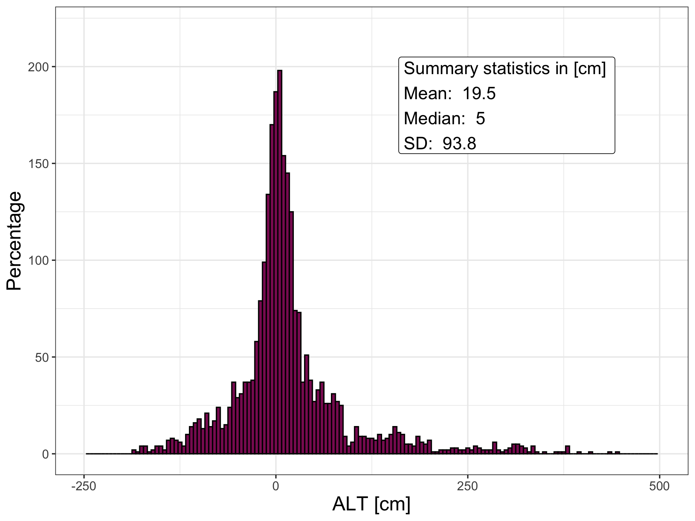
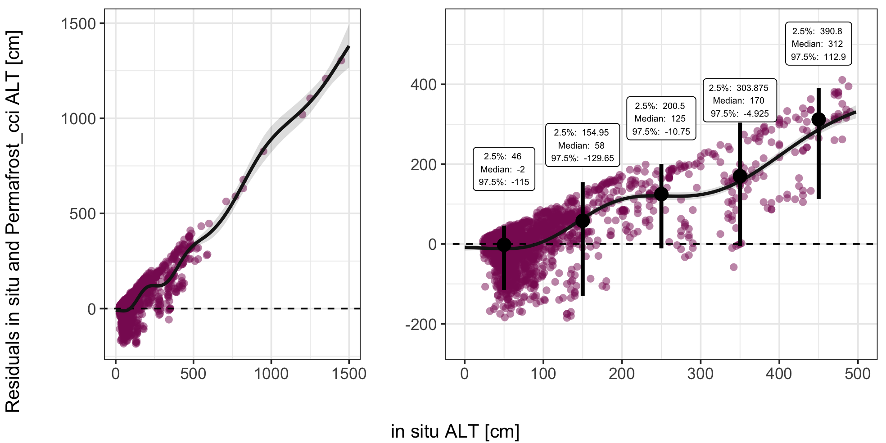
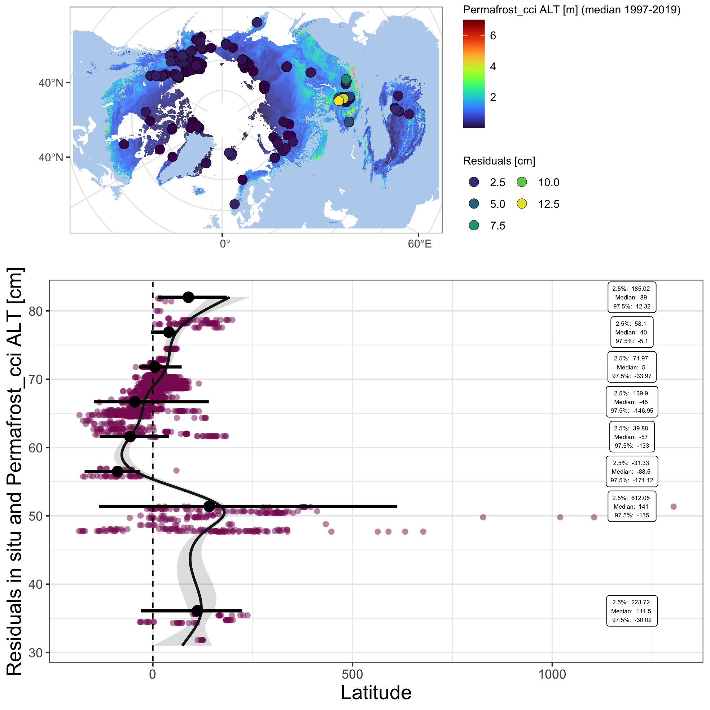

<style type="text/css">
.main-container {
  max-width: 1400px;
  margin-left: auto;
  margin-right: auto;
}
</style>


<details>
  <summary>R Library</summary>
  ```{r libraries, message=FALSE, warning=FALSE,  results=FALSE}
  library(readxl)
  library(ncdf4)
  library(raster)
  library(tidyverse)
  library(ggforce)
  library(grid)
  library(mgcv)
  library(sf)
  sf::sf_use_s2(FALSE)
  ```
</details><br/> 

```{r include = FALSE, results = FALSE}
  load("data/inSitu_alt.rda")
  inSitu_alt <- inSitu_alt %>% filter(!is.na(Depth) & !is.na(ALT_Permafrost_cci))
  
  ## base map
  mp <-  st_read("~/Google Drive/My Drive/GeoDat/NaturalEarth/50m_physical/ne_50m_land/ne_50m_land.shp", quiet = TRUE) %>% 
    st_set_crs(4326) %>% st_buffer(0) %>% st_union() %>%
    st_sym_difference(st_read("~/Google Drive/My Drive/GeoDat/NaturalEarth/110m_physical/ne_110m_lakes/ne_110m_lakes.shp", quiet = TRUE) %>% 
                        st_set_crs(4326) %>% st_union()) %>%
    st_transform("+proj=stere +lat_0=90 +lat_ts=71 +lon_0=0 +x_0=0 +y_0=0 +datum=WGS84 +units=m +no_defs") %>%
    st_crop(st_bbox(c(xmin = -5.5e6, ymin = -4e6, xmax = 8e6, ymax = 4e6)))
  
  map <- ggplot() +
    geom_sf(data = mp, colour = NA, fill = "slategray2") +
    theme_bw() +
    xlim(-5e6, 7.5e6) + ylim(-3.8e6, 3.8e6)
  
  # rast <- stack(lapply(list.files("~/Documents/ESAproject/SimulationData/ActiveLayerThickness/", full.names = T),
  #                function(r) raster(r)))
  # rag  <- aggregate(rast, 15)
  # med  <- calc(rag, median, na.rm = T)
  # rast_spdf <- as(med, "SpatialPixelsDataFrame")
  # rast_df   <- as.data.frame(rast_spdf)
  # colnames(rast_df) <- c("value", "x", "y")
  # save(rast_df, file = "data/temp/rast_df_alt.rda")
  load("data/temp/rast_df_alt.rda")
```

<details>
  <summary>Figure 4.3 code</summary>
  ```{r}
  subDat <- inSitu_alt %>% as_tibble() %>%mutate(ALT_Permafrost_cci = ALT_Permafrost_cci*100,
                                  delta = Depth - ALT_Permafrost_cci)
  
    png("figures/Figure_4.3.png", width = 20, height = 15, units = "cm", res = 250)
    ggplot(NULL, aes(x)) +
      geom_histogram(data = subDat, mapping = aes(x = delta), binwidth=5, position="dodge", fill = "maroon4", col = "black")  +
      geom_label(aes(x = 160, y = 180), size = 5,
        label = paste("Summary statistics in [cm]", "\nMean: ", round(mean(subDat$delta, na.rm = T), 1), 
        "\nMedian: ", round(median(subDat$delta, na.rm = T), 1), "\nSD: ", round(sd(subDat$delta, na.rm = T), 1)),
        hjust = 0) +
      theme_bw() +
      xlim(-250, 500) +
      ylim(0, 220) +
      labs(fill='', x = "ALT [cm]", y = "Percentage") +
      theme(text = element_text(size=rel(4)),
            legend.text = element_text(size=14))
    dev.off()  
  ```
</details><br/> 


_Figure 4.3: Frequency distribution of residuals from the ALT in situ and Permafrost_cci matchup._

<details>
  <summary>Figure 4.4 code</summary>
  ```{r}
  ###################
  #### Residuals ####
  ###################
  predInterval <- function(x, newdat, lower = .025, upper = 0.975) {
      
        model  = x
      
        p          <- predict(model, newdat, type = "link", se.fit = TRUE)
        upr        <- p$fit + (2 * p$se.fit)
        lwr        <- p$fit - (2 * p$se.fit)
        newdat$upr <- model$family$linkinv(upr)
        newdat$lwr <- model$family$linkinv(lwr)
        newdat$fit <- predict(model, newdat)
        
        beta      <- coef(model)
        V         <- vcov(model)
        num_beta_vecs <- 10000
        Cv            <- chol(V)
        nus         <- rnorm(num_beta_vecs * length(beta))
        beta_sims   <- beta + t(Cv) %*% matrix(nus, nrow = length(beta), ncol = num_beta_vecs)
        covar_sim   <- predict(model, newdata = newdat, type = "lpmatrix")
        linpred_sim <- covar_sim %*% beta_sims
        invlink     <- function(x) x
        exp_val_sim <- invlink(linpred_sim)
        y_sim       <- matrix(rnorm(n = prod(dim(exp_val_sim)), mean = exp_val_sim, sd = summary(model)$scale), 
                        nrow = nrow(exp_val_sim), 
                        ncol = ncol(exp_val_sim))
        
        out <- as.data.frame(t(apply(y_sim, 1, quantile, prob = c(lower, upper))))
          names(out)[1:2] <- c("plwr", "pupr")
          
        cbind(newdat, out)
    }
  
  model   <- gam(delta ~ s(Depth), data = subDat)
      
  newdat  <- data.frame(Depth = seq(0, 1500, length = 200))
  dat     <- lapply(list(model), predInterval, newdat = newdat)
    
  
  pl1 <- ggplot(NULL, aes(x, y)) +
    geom_point(subDat, mapping = aes(x = Depth, y = delta), alpha = 0.5, shape = 16, col  = "maroon4", size = 2) + 
    geom_abline(slope = 0, intercept = 0, linetype = "dashed") +
    geom_ribbon(data = dat[[1]], mapping = aes(x = Depth, y = fit, ymin = lwr, ymax = upr), alpha = 0.15, fill = "grey10") +
    geom_line(data   = dat[[1]], mapping = aes(x = Depth, y = fit), col = "grey10", size = 1) +
    theme_bw() +
    labs(x = "", y = "") +
    theme(text = element_text(size=rel(4)))
  
  p <- c(0.025, 0.5, 0.975)
  p_names <- map_chr(p, ~paste0(.x*100, "%"))
  p_funs <- map(p, ~partial(quantile, probs = .x, na.rm = TRUE))
  
  boxDat <- subDat %>% filter(Depth <= 500) %>%
    mutate(groupD = cut(Depth, seq(0, 500, 100), labels = FALSE)) %>%
    group_by(groupD) %>% summarize_at(vars(delta), funs(!!!p_funs))
  names(boxDat) <- c("groupD", "lower", "median", "upper")
  
  
  pl2 <- ggplot(NULL, aes(x, y)) +
    geom_point(subDat, mapping = aes(x = Depth, y = delta), alpha = 0.5, shape = 16, col  = "maroon4", size = 2) + 
    geom_abline(slope = 0, intercept = 0, linetype = "dashed") +
    geom_ribbon(data = dat[[1]], mapping = aes(x = Depth, y = fit, ymin = lwr, ymax = upr), alpha = 0.15, fill = "grey10") +
    geom_line(data   = dat[[1]], mapping = aes(x = Depth, y = fit), col = "grey10", size = 1) +
    geom_segment(boxDat, mapping = aes(x = ((groupD -1) * 100) + 50, xend = ((groupD -1) * 100) + 50, y = lower, yend = upper), size = 1.2) +
    geom_point(boxDat,  mapping = aes(x = ((groupD -1) * 100) + 50, y = median), size = 4, shape = 16) +
    geom_label(boxDat, mapping = aes(x = ((groupD -1) * 100) + 50, y = median + 190, 
      label = paste("2.5%: ", upper, "\nMedian: ", median, "\n97.5%: ", lower)), size = 2) +
    theme_bw() +
    xlim(0,500) + ylim(-250, 550) +
    labs(x = "", y = "") +
    theme(text = element_text(size=rel(4)))
  
  
  png("figures/Figure_4.4.png", width = 20, height = 10, units = "cm", res = 250)
  gridExtra::grid.arrange(pl1, pl2, nrow =1, widths = c(1,1.5), bottom = "in situ ALT [cm]", left = "Residuals in situ and Permafrost_cci ALT [cm]")
  dev.off()
  ```
</details><br/> 


_Figure 4.4: Residuals of in situ ALT measurements and Permafrost_cci ALT simulations over ALT._

<details>
  <summary>Figure 4.5 code</summary>
  ```{r}
  maxTab <- subDat %>% group_by(Name) %>% mutate(maxRes = max(abs(delta)/100, na.rm = T)) %>%
    filter(!duplicated(Name)) %>% arrange((maxRes))
  
  crds_pts <- st_as_sf(maxTab, coords = c("Longitude", "Latitude")) %>% st_set_crs(4326) %>%
      st_transform("+proj=stere +lat_0=90 +lat_ts=71 +lon_0=0 +x_0=0 +y_0=0 +datum=WGS84 +units=m +no_defs") %>% st_coordinates()
    
  
  pl1 <-map +
    geom_raster(data=rast_df, aes(x=x, y=y, fill=value), alpha=0.8) + 
      viridis::scale_fill_viridis(option = "H") +
    labs(fill = "Permafrost_cci ALT [m] (median 1997-2019)") +
    ggnewscale::new_scale_fill() +
    geom_point(data = data.frame(crds_pts, maxRes = maxTab$maxRes), 
                   aes(x = X, y = Y, fill = maxRes), alpha = 1, shape = 21, stroke = 0.2, size = 3.5) +
    scale_fill_viridis_c() +
    labs(fill = "Residuals [m]", x = "", y = "") +
    theme(legend.background = element_rect(fill = "white"),
          legend.text = element_text(size=rel(0.8)),
          legend.title = element_text(size=rel(0.8))) +
    guides(fill=guide_legend(ncol=2))
  
  
  model   <- gam(delta ~ s(Latitude), data = subDat)
  newdat  <- data.frame(Latitude = seq(31, 82, length = 200))
  dat     <- lapply(list(model), predInterval, newdat = newdat)
  
  
  grL    <- data.frame(gr = 1:11, groupL = seq(31, 82, length = 11))
  boxDat <- subDat %>% mutate(gr = cut(Latitude, grL$groupL, labels = FALSE)) %>%
      group_by(gr) %>% summarize_at(vars(delta), funs(!!!p_funs)) %>% left_join(grL) %>%
      mutate(grL = groupL + median(diff(grL$groupL)))
  names(boxDat) <- c("groupD", "lower", "median", "upper", "a", "groupL")
  
      
  pl2 <- ggplot(NULL, aes(x, y)) +
      geom_point(subDat, mapping = aes(x = Latitude, y = delta), alpha = 0.5, shape = 16, col  = "maroon4", size = 2) + 
      geom_abline(slope = 0, intercept = 0, linetype = "dashed") +
      geom_ribbon(data = dat[[1]], mapping = aes(x = Latitude, y = fit, ymin = lwr, ymax = upr), alpha = 0.15, fill = "grey10") +
      geom_line(data   = dat[[1]], mapping = aes(x = Latitude, y = fit), col = "grey10", size = 1) +
    
      geom_segment(boxDat, mapping = aes(x = groupL, xend = groupL, y = lower, yend = upper), size = 1.2) +
      geom_point(boxDat,   mapping = aes(x = groupL, y = median), size = 4, shape = 16) +
      geom_label(boxDat,   mapping = aes(x = groupL, y = rep(1200, nrow(boxDat)), 
        label = paste("2.5%: ", round(upper,2), "\nMedian: ", round(median,2), "\n97.5%: ", round(lower,2))), size = 1.7) +
    
    
      theme_bw() +
      labs(x = "Residuals in situ and Permafrost_cci ALT [cm]", y = "Latitude") +
      coord_flip() +
      theme(text = element_text(size=rel(4)))
  
  png("figures/Figure_4.5.png", width = 20, height = 20, units = "cm", res = 250)
  gridExtra::grid.arrange(pl1, pl2, nrow =2, heights = c(1, 1.6))
  dev.off()
  ```
</details><br/> 


