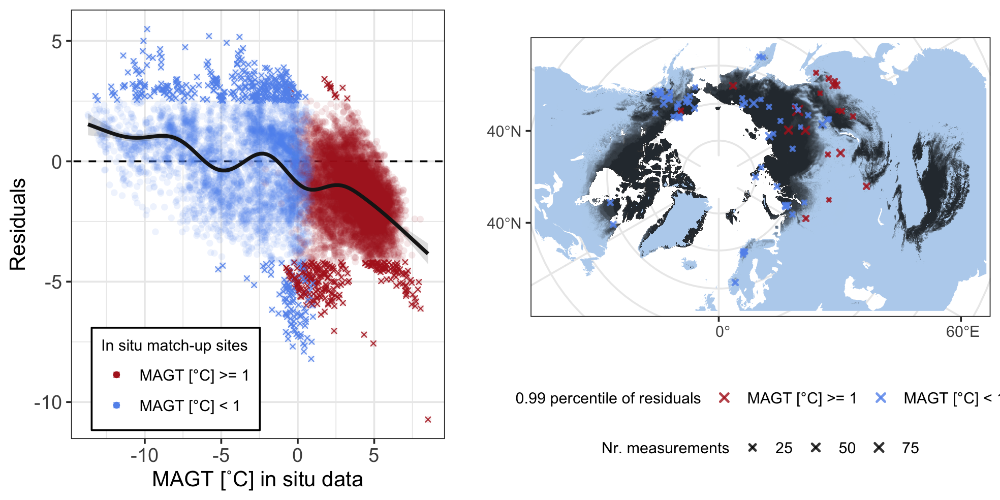

<style type="text/css">
.main-container {
  max-width: 1400px;
  margin-left: auto;
  margin-right: auto;
}
</style>


<details>
  <summary>R Library</summary>
  ```{r libraries, message=FALSE, warning=FALSE,  results=FALSE}
  library(readxl)
  library(ncdf4)
  library(raster)
  library(tidyverse)
  library(ggforce)
  library(grid)
  library(mgcv)
  library(sf)
  sf::sf_use_s2(FALSE)
  ```
</details><br/> 

```{r include = FALSE, results = FALSE}
  load("data/inSitu_temp.rda")
  
  ## base map
  mp <-  st_read("~/Google Drive/My Drive/GeoDat/NaturalEarth/50m_physical/ne_50m_land/ne_50m_land.shp", quiet = TRUE) %>% 
    st_set_crs(4326) %>% st_buffer(0) %>% st_union() %>%
    st_sym_difference(st_read("~/Google Drive/My Drive/GeoDat/NaturalEarth/110m_physical/ne_110m_lakes/ne_110m_lakes.shp", quiet = TRUE) %>% 
                        st_set_crs(4326) %>% st_union()) %>%
    st_transform("+proj=stere +lat_0=90 +lat_ts=71 +lon_0=0 +x_0=0 +y_0=0 +datum=WGS84 +units=m +no_defs") %>%
    st_crop(st_bbox(c(xmin = -5.5e6, ymin = -4e6, xmax = 8e6, ymax = 4e6)))
  
  map <- ggplot() +
    geom_sf(data = mp, colour = NA, fill = "slategray2") +
    theme_bw() +
    xlim(-5e6, 7.5e6) + ylim(-3.8e6, 3.8e6)
  
  # rast <- raster("~/Documents/ESAproject/SimulationData/PermafrostExtent/ESACCI-PERMAFROST-L4-PFR-MODISLST_CRYOGRID-AREA4_PP-2018-fv03.0.nc")
  # rast_spdf <- as(aggregate(rast, 15), "SpatialPixelsDataFrame")
  # rast_df   <- as.data.frame(rast_spdf)
  # colnames(rast_df) <- c("value", "x", "y")
  # save(rast_df, file = "Rmarkdown/temp/rast_df.rda")
  load("data/temp/rast_df.rda")
```


## In situ MAGT vs Permafrost_cci MAGT

<details>
  <summary>Figure 3.1 code</summary>
  ```{r}
    mod   <- lm(MAGT_Permafrost_cci~Temp, data = inSitu_temp)
    modM  <- data.frame(Temp=seq(min(inSitu_temp$Temp), max(inSitu_temp$Temp), length = 50))
    modM  <- data.frame(modM, predict(mod, newdata=modM, interval = "prediction"))
    
    png("figures/Figure_3.1.png", width = 20, height = 10, units = "cm", res = 250)
    ggplot(NULL, aes(x, y)) +
        geom_label(aes(-15, 6.5, hjust = 0, vjust = 0,
                       label = paste0("Slope =",signif(mod$coef[[2]], 3), "\n", "R^2 = ", signif(summary(mod)$adj.r.squared, 3))), size = 5) +
        geom_point(data = inSitu_temp, mapping = aes(Temp, MAGT_Permafrost_cci), 
                   alpha = 0.1, shape = 16, fill = "grey40") +
        theme_bw() + 
        geom_abline(slope = 1, intercept = 0, linetype = "dashed") +
        # geom_ribbon(data = modM, mapping = aes(x = Temp, y = fit, ymin = lwr, ymax = upr), alpha = 0.15) +
        geom_line(  data = modM, mapping = aes(x = Temp, y = fit), col = "cornflowerblue", size = 1.5) +
        labs(y = "MAGT [˚C] Permafrost_cci", x = "MAGT [˚C] in situ data") +
        xlim(-15, 10) + ylim(-15, 10) +
        theme(text = element_text(size=rel(3.5)))
    dev.off()
  ```
</details>
  


## Residuals

### Residuals over MAGT


<details>
  <summary>Figure 3.2 code</summary>
  ```{r}
  ###################
  #### Residuals ####
  ###################
  predInterval <- function(x, newdat, lower = .025, upper = 0.975) {
    
      model  = x
    
      p          <- predict(model, newdat, type = "link", se.fit = TRUE)
      upr        <- p$fit + (2 * p$se.fit)
      lwr        <- p$fit - (2 * p$se.fit)
      newdat$upr <- model$family$linkinv(upr)
      newdat$lwr <- model$family$linkinv(lwr)
      newdat$fit <- predict(model, newdat)
      
      beta      <- coef(model)
      V         <- vcov(model)
      num_beta_vecs <- 10000
      Cv            <- chol(V)
      nus         <- rnorm(num_beta_vecs * length(beta))
      beta_sims   <- beta + t(Cv) %*% matrix(nus, nrow = length(beta), ncol = num_beta_vecs)
      covar_sim   <- predict(model, newdata = newdat, type = "lpmatrix")
      linpred_sim <- covar_sim %*% beta_sims
      invlink     <- function(x) x
      exp_val_sim <- invlink(linpred_sim)
      y_sim       <- matrix(rnorm(n = prod(dim(exp_val_sim)), mean = exp_val_sim, sd = summary(model)$scale), 
                      nrow = nrow(exp_val_sim), 
                      ncol = ncol(exp_val_sim))
      
      out <- as.data.frame(t(apply(y_sim, 1, quantile, prob = c(lower, upper))))
        names(out)[1:2] <- c("plwr", "pupr")
        
      cbind(newdat, out)
  }
  
  resTab <- inSitu_temp %>% filter(!is.na(Temp) & !is.na(MAGT_Permafrost_cci)) %>%
                       mutate(res =  as.numeric(resid(lm(MAGT_Permafrost_cci-Temp ~ 0))))
  
  #### over Temps
  model   <- gam(res ~ s(Temp), data = resTab)
    
  newdat  <- data.frame(Temp = seq(min(resTab$Temp), max(resTab$Temp), length = 100))
  dat     <- lapply(list(model), predInterval, newdat = newdat)
  
  ## Outliers

  pl1 <- ggplot(NULL, aes(x, y)) +
    theme_bw() +
    geom_abline(slope = 0, intercept = 0, linetype = "dashed") +
    geom_point(data = resTab, mapping = aes(Temp, res, col = coldSite), alpha = 0.1, shape = 16, size = 1.5) +
    geom_point(data = resTab %>% filter(res<quantile(res, probs = 0.025) | res>quantile(res, probs = 0.975)), 
    mapping = aes(Temp, res, col = coldSite), alpha = 0.8, shape = 4, size = 1) +
      scale_color_manual(values = c("firebrick", "cornflowerblue"), labels = c('MAGT [°C] >= 1', 'MAGT [°C] < 1')) +
    
    geom_ribbon(data = dat[[1]], mapping = aes(x = Temp, y = fit, ymin = lwr, ymax = upr), alpha = 0.15, fill = "grey10") +
    geom_line(data   = dat[[1]], mapping = aes(x = Temp, y = fit), col = "grey10", size = 1) +
    
    labs(y = "Residuals", x = "MAGT [˚C] in situ data", col = "In situ match-up sites") +
    
    guides(colour = guide_legend(override.aes = list(alpha = 1))) +
    
    theme(axis.title = element_text(size=rel(1.1)),
          axis.text = element_text(size=rel(1)),
          legend.position = c(0.28, 0.14),
          legend.background = element_rect(fill = "white", color = "black"),
          legend.text = element_text(size=rel(0.8)),
          legend.title = element_text(size=rel(0.8)))
  
  resMap <- resTab %>% filter(res<quantile(res, probs = 0.025) | res>quantile(res, probs = 0.975)) %>% group_by(Name) %>% mutate(N = n()) %>%
    filter(!duplicated(Name))
  
  
  crds_pts <- st_as_sf(resMap, coords = c("Longitude", "Latitude")) %>% st_set_crs(4326) %>%
    st_transform("+proj=stere +lat_0=90 +lat_ts=71 +lon_0=0 +x_0=0 +y_0=0 +datum=WGS84 +units=m +no_defs") %>% st_coordinates()
  
  pl2 <- map +
    geom_raster(data=rast_df, aes(x=x, y=y, fill=value), alpha=0.8, show.legend = FALSE) + 
      scale_fill_gradient(low="slategray2", high="black") +
      labs(fill = "Permafrost_cci PFR (2018)") +
      ggnewscale::new_scale_fill() +
      geom_jitter(data = data.frame(crds_pts, coldSite = resMap$coldSite, n = resMap$N), 
                 aes(x = X, y = Y, col = coldSite, size = n), alpha = 0.8, shape = 4, stroke = 1, width = 60000, height = 60000) +
      scale_color_manual(values = c("firebrick", "cornflowerblue"), labels = c('MAGT [°C] >= 1', 'MAGT [°C] < 1')) +
      scale_size(range = c(0.15, 1.7)) +
      labs(x = "", y = "", col = "0.99 percentile of residuals", size = "Nr. measurements") +
      theme(legend.position="bottom", legend.box="vertical", legend.margin=margin(),
            legend.background = element_rect(fill = "white"),
            legend.text = element_text(size=rel(0.8)),
            legend.title = element_text(size=rel(0.8)))
  
  
  png("figures/Figure_3.2.png", width = 20, height = 10, units = "cm", res = 250)
  gridExtra::grid.arrange(pl1, pl2, nrow =1, widths = c(1,1.2))
  dev.off()
  ```
</details><br/>
  


### Residuals over Depth

<details>
  <summary>Figure 3.3 code</summary>
  ```{r}
  
  #### over Depths
  model1   <- gam(res ~ s(Depth), data = resTab)
  model2   <- gam(res ~ s(Depth), data = resTab %>% filter(!coldSite))
  model3   <- gam(res ~ s(Depth), data = resTab %>% filter(coldSite))
  
  ### confidence interval
  newdat     <- data.frame(Depth = seq(min(resTab$Depth), max(resTab$Depth), length = 100))
  dat        <- lapply(list(model1, model2, model3), predInterval, newdat = newdat)
  
  qtilesWarm     <- resTab %>% filter(!coldSite) %>% group_by(Depth) %>% summarise(upper = quantile(res, probs = 0.05), lower = quantile(res, probs = 0.95))
  qtilesCold     <- resTab %>% filter(coldSite) %>% group_by(Depth) %>% summarise(upper = quantile(res, probs = 0.05), lower = quantile(res, probs = 0.95))
  
  pl1 <- ggplot(NULL, aes(x, y)) +
    theme_bw() +
    geom_abline(slope = 0, intercept = 0, linetype = "dashed") +
    geom_point(data = resTab, mapping = aes(Depth, res), alpha = 0.1, shape = 16, size = .7, show.legend = FALSE) +
    geom_ribbon(data = dat[[1]], mapping = aes(x = Depth, y = fit, ymin = plwr, ymax = pupr), alpha = 0.05) +
    geom_ribbon(data = dat[[1]], mapping = aes(x = Depth, y = fit, ymin = lwr, ymax = upr), alpha = 0.1, fill = "grey10") +
    geom_line(data = dat[[1]], mapping = aes(x = Depth, y = fit), col = "grey10", size = 1) +
    labs(y = "", x = "") +
    theme(text = element_text(size=rel(3.5)))
  
  
  pl2 <- ggplot(NULL, aes(x, y)) +
    theme_bw() +
    geom_label(aes(1300, -10, hjust = 0, vjust = 0, label = "MAGT [°C] >= 1"), size = 3) +
    geom_abline(slope = 0, intercept = 0, linetype = "dashed") +
    geom_point(data = resTab, mapping = aes(Depth, res, col = coldSite), alpha = 0.05, shape = 16, size = 0.7, show.legend = FALSE) +
            scale_color_manual(values = c("firebrick", "cornflowerblue"), labels = c('MAGT [°C] >= 1', 'MAGT [°C] < 1')) +
  
    geom_ribbon(dat[[2]], mapping = aes(x = Depth, y = fit, ymin = upr, ymax = lwr), alpha = 0.15) +
    geom_line(dat[[2]],   mapping = aes(x = Depth, y = fit), col = "firebrick", size = 1) +
    geom_smooth(qtilesWarm, mapping = aes(x = Depth, y = lower), col = "firebrick", size = 0.5, se = FALSE, span = 0.45) +
    geom_smooth(qtilesWarm, mapping = aes(x = Depth, y = upper), col = "firebrick", size = 0.5, se = FALSE, span = 0.45) +
    labs(y = "", x = "") +
    
    theme(text = element_text(size=rel(3.5)))
  
  
  pl3 <- ggplot(NULL, aes(x, y)) +
    theme_bw() +
    geom_label(aes(1300, -10, hjust = 0, vjust = 0, label = "MAGT [°C] < 1"), size = 3) +
    geom_abline(slope = 0, intercept = 0, linetype = "dashed") +
    geom_point(data = resTab, mapping = aes(Depth, res, col = coldSite), alpha = 0.05, shape = 16, size = 0.7, show.legend = FALSE) +
            scale_color_manual(values = c("firebrick", "cornflowerblue"), labels = c('MAGT [°C] >= 1', 'MAGT [°C] < 1')) +
  
    geom_ribbon(dat[[3]], mapping = aes(x = Depth, y = fit, ymin = upr, ymax = lwr), alpha = 0.15) +
    geom_line(dat[[3]],   mapping = aes(x = Depth, y = fit), col = "cornflowerblue", size = 1) +
    geom_smooth(qtilesCold, mapping = aes(x = Depth, y = lower), col = "cornflowerblue", size = 0.5, se = FALSE, span = 0.45) +
    geom_smooth(qtilesCold, mapping = aes(x = Depth, y = upper), col = "cornflowerblue", size = 0.5, se = FALSE, span = 0.45) +
    labs(y = "", x = "") +
    theme(text = element_text(size=rel(3.5)))
  
  
  png("figures/Figure_3.3.png", width = 20, height = 10, units = "cm", res = 250)
  gridExtra::grid.arrange(pl1, pl2, pl3, layout_matrix = rbind(c(1,2),c(1,3)), heights=c(1, 1), bottom = "Depths [cm] of MAGT measurement",
                          left = "Residuals")
  dev.off()
  
  ```
</details><br/>
  


### Residuals over space

<details>
  <summary>Figure 3.4 code</summary>
  ```{r}
  #### over Latitudes
  model   <- gam(res ~ s(Latitude), data = resTab)
  
  
  ### confidence interval
  newdat     <- data.frame(Latitude = seq(min(resTab$Latitude), max(resTab$Latitude), length = 100))
  dat        <- lapply(list(model), predInterval, newdat = newdat)
  
  qtilesWarm     <- resTab %>% filter(!coldSite) %>% mutate(Latgr = as.character(cut(Latitude, seq(45, 90, length = 60)))) %>%
    mutate(grLat = as.numeric(substring(Latgr, 2, 5)) + (as.numeric(substring(Latgr, 7, 10)) - as.numeric(substring(Latgr, 2, 5)))) %>%
    group_by(grLat) %>% summarise(upper = quantile(res, probs = 0.05), lower = quantile(res, probs = 0.95))
  
  qtilesCold     <- resTab %>% filter(coldSite) %>% mutate(Latgr = as.character(cut(Latitude, seq(45, 90, length = 60)))) %>%
    mutate(grLat = as.numeric(substring(Latgr, 2, 5)) + (as.numeric(substring(Latgr, 7, 10)) - as.numeric(substring(Latgr, 2, 5)))) %>%
    group_by(grLat) %>% summarise(upper = quantile(res, probs = 0.05), lower = quantile(res, probs = 0.95))
  
    
  pl1 <- ggplot(NULL, aes(x, y)) +
    theme_bw() +
    geom_abline(slope = 0, intercept = 0, linetype = "dashed") +
    geom_point(data = resTab, mapping = aes(Latitude, res, col = coldSite), alpha = 0.05, shape = 16, size = 0.7, show.legend = FALSE) +
               scale_color_manual(values = c("firebrick", "cornflowerblue"), labels = c('MAGT [°C] >= 1', 'MAGT [°C] < 1')) +
    
    geom_ribbon(data = dat[[1]], mapping = aes(x = Latitude, y = fit, ymin = lwr, ymax = upr), alpha = 0.15, fill = "grey10") +
      geom_line(data = dat[[1]], mapping = aes(x = Latitude, y = fit), col = "grey10", size = 1.5) +
    
    geom_smooth(qtilesWarm, mapping = aes(x = grLat, y = lower), col = "firebrick", size = 0.5, se = FALSE, span = 0.45) +
    geom_smooth(qtilesWarm, mapping = aes(x = grLat, y = upper), col = "firebrick", size = 0.5, se = FALSE, span = 0.45) +
    
    geom_smooth(qtilesCold, mapping = aes(x = grLat, y = lower), col = "cornflowerblue", size = 0.5, se = FALSE, span = 0.45) +
    geom_smooth(qtilesCold, mapping = aes(x = grLat, y = upper), col = "cornflowerblue", size = 0.5, se = FALSE, span = 0.45) +
    
    ylim(-7,5) +
    coord_flip() +
  
    
    labs(y = "Residuals", x = "Latitude of MAGT [˚C] in situ data") +
    theme(text = element_text(size=rel(3.5)))


  #### over Longitudes
  model   <- gam(res ~ s(Longitude), data = resTab)
  
  
  ### confidence interval
  newdat     <- data.frame(Longitude = seq(-180, 180, length = 100))
  dat        <- lapply(list(model), predInterval, newdat = newdat)
  
  LonGroup <- data.frame(Lon = seq(-180, 180, length = 180), LonGr = 1:180)
  
  qtilesWarm     <- resTab %>% filter(!coldSite) %>% mutate(LonGr = cut(Longitude, seq(-180, 180, length = 180), labels = FALSE)) %>%
    left_join(LonGroup, by = "LonGr") %>%
    group_by(Lon) %>% summarise(upper = quantile(res, probs = 0.05), lower = quantile(res, probs = 0.95))
  
  qtilesCold     <- resTab %>% filter(coldSite) %>% mutate(LonGr = cut(Longitude, seq(-180, 180, length = 180), labels = FALSE)) %>%
    left_join(LonGroup, by = "LonGr") %>%
    group_by(Lon) %>% summarise(upper = quantile(res, probs = 0.05), lower = quantile(res, probs = 0.95))
    
  pl2 <- ggplot(NULL, aes(x, y)) +
    theme_bw() +
    geom_abline(slope = 0, intercept = 0, linetype = "dashed") +
    geom_point(data = resTab, mapping = aes(Longitude, res, col = coldSite), alpha = 0.05, shape = 16, size = 0.7, show.legend = FALSE) +
               scale_color_manual(values = c("firebrick", "cornflowerblue"), labels = c('MAGT [°C] >= 1', 'MAGT [°C] < 1')) +
    
    geom_ribbon(data = dat[[1]], mapping = aes(x = Longitude, y = fit, ymin = lwr, ymax = upr), alpha = 0.15, fill = "grey10") +
      geom_line(data = dat[[1]], mapping = aes(x = Longitude, y = fit), col = "grey10", size = 1.5) +
    
    geom_smooth(qtilesWarm %>% filter(Lon>0), mapping = aes(x = Lon, y = lower), col = "firebrick", size = 0.5, se = FALSE, span = 0.45) +
    geom_smooth(qtilesWarm %>% filter(Lon>0), mapping = aes(x = Lon, y = upper), col = "firebrick", size = 0.5, se = FALSE, span = 0.45) +
    
    geom_smooth(qtilesCold, mapping = aes(x = Lon, y = lower), col = "cornflowerblue", size = 0.5, se = FALSE, span = 0.45) +
    geom_smooth(qtilesCold, mapping = aes(x = Lon, y = upper), col = "cornflowerblue", size = 0.5, se = FALSE, span = 0.45) +
  
    labs(y = "Residuals", x = "Longitude of MAGT [˚C] in situ data") +
    theme(text = element_text(size=rel(3)))

  png("figures/Figure_3.4.png", width = 20, height = 10, units = "cm", res = 250)
  gridExtra::grid.arrange(pl1, pl2, layout_matrix = matrix(c(1,2), ncol = 2, byrow = TRUE))
  dev.off()
  ```
</details><br/>
  
