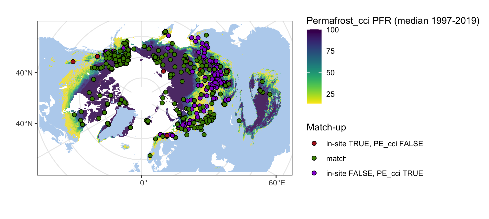

<style type="text/css">
.main-container {
  max-width: 1400px;
  margin-left: auto;
  margin-right: auto;
}
</style>

<details>
  <summary>R Library</summary>
  ```{r libraries, message=FALSE, warning=FALSE,  results=FALSE}
  library(readxl)
  library(ncdf4)
  library(raster)
  library(tidyverse)
  library(ggforce)
  library(grid)
  library(sf)
  sf::sf_use_s2(FALSE)
  ```
</details><br/> 

```{r, include = FALSE, warning=FALSE, message=FALSE, results=FALSE}
## base map
mp <-  st_read("~/Google Drive/My Drive/GeoDat/NaturalEarth/50m_physical/ne_50m_land/ne_50m_land.shp", quiet = TRUE) %>% 
    st_set_crs(4326) %>% st_buffer(0) %>% st_union() %>%
    st_sym_difference(st_read("~/Google Drive/My Drive/GeoDat/NaturalEarth/110m_physical/ne_110m_lakes/ne_110m_lakes.shp", quiet = TRUE) %>% 
    st_set_crs(4326) %>% st_union()) %>%
    st_transform("+proj=stere +lat_0=90 +lat_ts=71 +lon_0=0 +x_0=0 +y_0=0 +datum=WGS84 +units=m +no_defs") %>%
    st_crop(st_bbox(c(xmin = -5.5e6, ymin = -4e6, xmax = 8e6, ymax = 4e6)))

map <- ggplot() +
  geom_sf(data = mp, colour = NA, fill = "slategray2") +
  theme_bw() +
  xlim(-5e6, 7.5e6) + ylim(-3.8e6, 3.8e6)
    

# rast <- stack(lapply(list.files("/Users/slisovski/Documents/ESAproject/SimulationData/PermafrostExtent/", full.names = T),
#               function(r) raster(r)))
# rag       <- aggregate(rast, 15)
# med       <- calc(rag, median, na.rm = T)
# rast_spdf <- as(med, "SpatialPixelsDataFrame")
# rast_pe   <- as.data.frame(rast_spdf)
# colnames(rast_pe) <- c("value", "x", "y")
# save(rast_pe, file = "data/temp/rast_df_pe.rda")
load("data/temp/rast_df_pe.rda")
load("data/inSitu_pe.rda")
```

<details>
  <summary>Figure 4.3 code</summary>
  ```{r}
  mapDat <- inSitu_pe %>% mutate(falseTrue  = ifelse(pe  & is.na(PE_Permafrost_cci), 1, 
                                                                 ifelse(!pe & !is.na(PE_Permafrost_cci), 3, 2))) %>%
    filter(!duplicated(Name))
    
  
  crds_pts <- st_as_sf(mapDat, coords = c("Longitude", "Latitude")) %>% st_set_crs(4326) %>%
    st_transform("+proj=stere +lat_0=90 +lat_ts=71 +lon_0=0 +x_0=0 +y_0=0 +datum=WGS84 +units=m +no_defs") %>% st_coordinates()
    
  png("figures/Figure_5.1.png", width = 20, height = 9, units = "cm", res = 250)
  map +
    geom_raster(data=rast_pe, aes(x=x, y=y, fill=value), alpha=0.8) + 
    viridis::scale_fill_viridis(begin = 1, end = 0) +
    labs(fill = "Permafrost_cci PFR (median 1997-2019)") +
    ggnewscale::new_scale_fill() +
    geom_point(data = data.frame(crds_pts, shape = as.factor(mapDat$falseTrue)), 
               aes(x = X, y = Y, fill = shape), size = 2, shape = 21) +
    scale_fill_manual("Match-up",
                      values = c("firebrick", "chartreuse4", "darkviolet"),
                      labels = c("in-site TRUE, PE_cci FALSE", "match", "in-site FALSE, PE_cci TRUE")) + 
    labs(x = "", y = "")
  dev.off()
  ```
</details><br/> 

