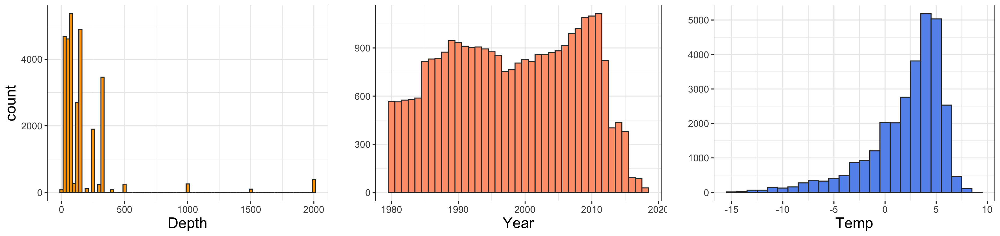
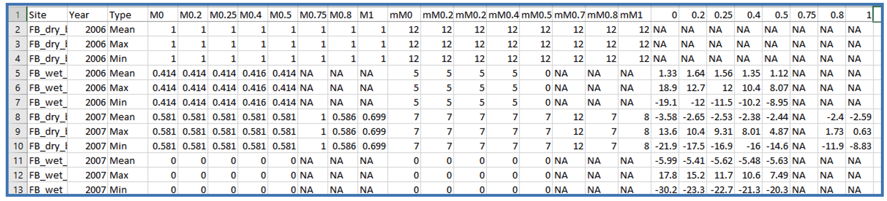
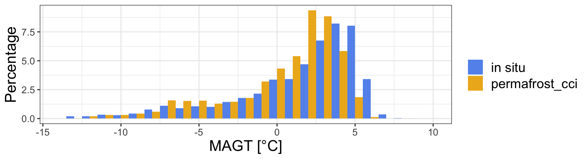
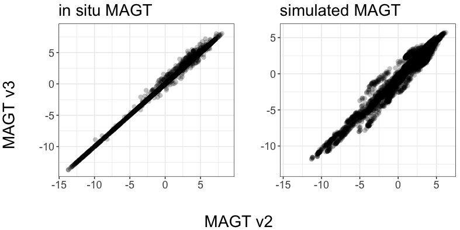

<style type="text/css">
.main-container {
  max-width: 1400px;
  margin-left: auto;
  margin-right: auto;
}
</style>

<details>
  <summary>R Library</summary>
  ```{r libraries, message=FALSE, warning=FALSE,  results=FALSE}
  library(readxl)
  library(ncdf4)
  library(raster)
  library(tidyverse)
  library(ggforce)
  library(grid)
  library(sf)
  sf::sf_use_s2(FALSE)
  ```
</details><br/> 

# Introduction

# Methods for quality assessment

The in situ dataset:

<details>
  <summary>Dataset compilation and crds match-up</summary>
  ```{r dataset v3, message=FALSE, warning=FALSE,  results=FALSE}
  ## correct coordinates from v2
  path    <- "/Users/slisovski/Documents/ESAproject/ValidationData/v2/20200813_MAGT_MATLAB_Style/"
  metadat <- read.table(glue::glue("{path}MAGT_meta.csv"), sep = ";", dec = ".", header = TRUE) %>% as_tibble()
  
  v2Dat <- lapply(metadat$cci_ID, function(x) {
      metadat[metadat$cci_ID==x,] %>%
        bind_cols(read.table(glue::glue("{path}MAGT_{x}.csv"), sep = ";", dec = ".", header = TRUE) %>% as_tibble()) %>%
        rename(Year = X) %>% pivot_longer(col = starts_with("X")) %>% rename(Depth = name, Temp = value) %>%
        filter(!is.na(Temp)) %>% mutate(Depth = as.numeric(gsub("X", "", Depth)), Simulation = NA)
      }) %>% bind_rows() %>% select(cci_ID, Name, Year, Latitude, Longitude) %>%
      group_by(cci_ID, Name, Year) %>% filter(row_number() == 1)
  
  
  ## GTD dataset
  inSitu_temp <- read_excel("/Users/slisovski/Documents/ESAproject/ValidationData/20210218_focus_mean_yr_3.xlsx",
                          col_types = c("numeric", rep("text", 3), rep("numeric", 7), "text", rep("numeric", 21), rep("text", 41))) %>%
    select(c("cci_ID", "Name", "Source", "Longitude", "Latitude", "Year", "Depth"), starts_with("X")) %>%
    mutate(Source = if_else(Source%in%c("M. Ulrich", "A. Kholodov", "PANGAEA", "Pangaea", "Wangetal"), "GTN-P", Source)) %>%
    mutate(Source = if_else(Source=="GTN-P", "GTN-P & USGS", if_else(Source=="Nordica", "Nordicana-D", Source))) %>%
    mutate(Source = if_else(Source=="Above", "NASA ABoVE", Source)) %>%
    rowwise() %>% mutate(coldSite = if(all(is.na(c_across(X0:X2000)))) NA else {ifelse(any(c_across(X0:X2000)>1, na.rm = T), FALSE, TRUE)}) %>%
    pivot_longer(col = starts_with("X")) %>% rename(maxDepth = Depth, Depth = name, Temp = value) %>% mutate(Depth = as.numeric(gsub("X", "", Depth))) %>%
    filter(!is.na(Temp)) %>%
    left_join(v2Dat, by = c("cci_ID", "Name", "Year")) %>%
    mutate(Latitude.y = if_else(is.na(Latitude.y), Latitude.x, Latitude.y), Longitude.y = if_else(is.na(Longitude.y), Longitude.x, Longitude.y)) %>%
    rename(Longitude = Longitude.y, Latitude = Latitude.y) %>%
    filter(!is.na(Latitude), !is.na(Latitude)) %>% select(-Latitude.x, -Longitude.x)
  ```
</details>

<details>
  <summary>Figure 2.1 code</summary>
  ```{r figure2.1, message=FALSE, warning=FALSE,  results=FALSE}
  pl1 <- ggplot(inSitu_temp, aes(x = Depth)) +
          geom_histogram(binwidth=25, position="dodge", col = "grey20", fill = "orange") +
          theme_bw() +
          theme(text = element_text(size=rel(4)))
  
  pl2 <- ggplot(inSitu_temp, aes(x = Year)) +
          geom_histogram(binwidth=1, position="dodge", col = "grey20", fill = "lightsalmon") +
          theme_bw() +
          labs(y = "") +
          theme(text = element_text(size=rel(4)))
  
  pl3 <- ggplot(inSitu_temp, aes(x = Temp)) +
          geom_histogram(binwidth=1, position="dodge", col = "grey20", fill = "cornflowerblue") +
          theme_bw() +
          labs(y = "") +
          theme(text = element_text(size=rel(4)))
  
  png("figures/Figure_2.1.png", width = 38, height = 9, units = "cm", res = 250)
  gridExtra::grid.arrange(pl1, pl2, pl3, nrow = 1)
  dev.off()
  ```
</details><br/>
  


_Figure 2.1: Sample size of complete in situ dataset of mean annual ground temperatures (MAGT) at discrete depths (left), for the years 1980 to 2019 (center), and across temperatures (right)._

## Pair-wise Match-Up Evaluation

We constructed a pixel-based pair-wise Permafrost_cci Match-up data collection based on 

i) standardised in situ ground temperature (GT) data from 1997 to 2019 with a circum-Arctic geographic coverage, providing mean annual ground temperature (MAGT) in discrete measurement depths per year. This data collection is assembled as merged and newly standardised data from the community GT data archives across all permafrost zones (continuous, discontinuous, sporadic, and isolated). We also use the in situ MAGT time series for the binary evaluation of permafrost abundance.

Reference in situ data sets for the Match-up evaluation are
- in situ MAGT [Latitude, Longitude] in discrete depths in annual resolution from 1997 to 2019
- in situ PFR [Latitude, Longitude] permafrost probability in annual resolution from 1997 to 2019

ii) standardised in situ active layer thickness (ALT) data from 1997 to 2019 with a circum-Arctic geographic coverage. We also use the ALT time series for a binary evaluation of permafrost abundance. This in situ data collection covers the continuous Permafrost zone.

Reference in situ data sets for the Match-up evaluation are
- in situ ALT [Latitude, Longitude] in annual resolution from 1997 to 20182019
- in situ PFR [Latitude, Longitude] permafrost probability in annual resolution from 1997 to 20182019

...

## Assessment of Permafrost Temperature

### In Situ Ground Temperature Reference Data Generation

<details>
  <summary>Match-up code</summary>
  ```{r MAGT matchup, eval=FALSE}
  ## path with files from https://catalogue.ceda.ac.uk/uuid/b25d4a6174de4ac78000d034f500a268
  path    <- "/Users/slisovski/Documents/ESAproject/SimulationData/GroundTemperature/"
  tempFls <- data.frame(fl = list.files(path))
  tempFls$year <- as.numeric(sapply(strsplit(tempFls$fl, "-"), function(x) x[7]))

  inSitu_temp$MAGT_Permafrost_cci  <- NA

  for(y in unique(tempFls$year)) {

    cat(sprintf('\r%d', y))
  
    indTab <- which(inSitu_temp$Year==y)
    subTab <- st_as_sf(inSitu_temp[indTab,], coords = c("Longitude", "Latitude"), crs = 4326)
  
    st <- stack(lapply(c("GST", "T1m", "T2m", "T5m", "T10m"), function(x) {
      r0 <- raster(glue::glue("{path}{tempFls$fl[tempFls$year==y]}"), varname = x)
    }))
    proj4string(st) <- "+proj=stere +lat_0=90 +lat_ts=71 +lon_0=0 +x_0=0 +y_0=0 +datum=WGS84 +units=m +no_defs"
  
    extrM <- raster::extract(st, subTab %>% st_transform("+proj=stere +lat_0=90 +lat_ts=71 +lon_0=0 +x_0=0 +y_0=0 +datum=WGS84 +units=m +no_defs") %>%
                     st_coordinates())
  
    inSitu_temp$MAGT_Permafrost_cci[indTab] <- apply(cbind(subTab$Depth/100, extrM), 1, function(x) {
      if(sum(!is.na(x[-1]))>1) {
      Hmisc::approxExtrap(c(0, 1, 2, 5, 10), x[-1], x[1])$y
      } else NA
    })
  
  }
  save(inSitu_temp, file = "data/inSitu_temp.rda")
  ```
</details><br/>

```{r, include=FALSE}
load("data/inSitu_temp.rda")
inSitu_temp <- inSitu_temp %>% filter(!is.na(Temp) & !is.na(MAGT_Permafrost_cci))
```


_Version 3 synthesised permafrost temperature at discrete depths_
Permafrost_cci match-up in situ data in Phase 3 and Version 3 contains standardized annual ground temperatures (GTD) at various depths  with a circum-Arctic coverage across 1997 to 2019. The mean annual GTD data at different discrete depths and time stamps was compiled from available national and international programs. Depths include 0, 0.2, 0.25, 0.4, 0.5, 0.6, 0.75, 0.8, 1.0, 1.2, 1.6, 2.0, 2.4, 2.5, 3.0, 3.2, 4.0, 5.0, 10.0, 15.0, 20.0 meter below ground.

Data sources:

- [Global Terrestrial Network for Permafrost GTN-P WMO/GCOS](https://gtnp.arcticportal.org/)
- Roshydromet RHM [national monitoring programme, Russia](http://meteo.ru/data/164-soil-temperature)  
- Nordicana-D [world data repository for Polar research, Canada](http://www.cen.ulaval.ca/nordicanad/dpage.aspx?doi=45291SL34F28A9491014AFD; Allard et al., 2016, CEN 2013), 
- NASA ABoVE ...

<details>
  <summary>Figure 2.2 code</summary>
  ```{r figure2.2, message=FALSE, warning=FALSE,  results=FALSE}
  ## base map
    mp <-  st_read("~/Google Drive/GeoDat/NaturalEarth/50m_physical/ne_50m_land/ne_50m_land.shp", quiet = TRUE) %>% 
    st_set_crs(4326) %>% st_buffer(0) %>% st_union() %>%
    st_sym_difference(st_read("~/Google Drive/GeoDat/NaturalEarth/110m_physical/ne_110m_lakes/ne_110m_lakes.shp", quiet = TRUE) %>% 
    st_set_crs(4326) %>% st_union()) %>%
    st_transform("+proj=stere +lat_0=90 +lat_ts=71 +lon_0=0 +x_0=0 +y_0=0 +datum=WGS84 +units=m +no_defs") %>%
    st_crop(st_bbox(c(xmin = -5.5e6, ymin = -4e6, xmax = 8e6, ymax = 4e6)))

  map <- ggplot() +
    geom_sf(data = mp, colour = NA, fill = "slategray2") +
    theme_bw() +
    xlim(-5e6, 7.5e6) + ylim(-3.8e6, 3.8e6)
    
  # rast <- raster("~/Documents/ESAproject/SimulationData/PermafrostExtent/ESACCI-PERMAFROST-L4-PFR-MODISLST_CRYOGRID-AREA4_PP-2018-fv03.0.nc")
  # rast_spdf <- as(aggregate(rast, 15), "SpatialPixelsDataFrame")
  # rast_df   <- as.data.frame(rast_spdf)
  # colnames(rast_df) <- c("value", "x", "y")
  # save(rast_df, file = "Rmarkdown/temp/rast_df.rda")
  load("data/temp/rast_df.rda")
  
  mapDat <- inSitu_temp %>% group_by(Source) %>% mutate(nSource = n()) %>%
    filter(!duplicated(Name)) %>% arrange(desc(nSource))
  
  crds_pts <- st_as_sf(mapDat, coords = c("Longitude", "Latitude")) %>% st_set_crs(4326) %>%
  st_transform("+proj=stere +lat_0=90 +lat_ts=71 +lon_0=0 +x_0=0 +y_0=0 +datum=WGS84 +units=m +no_defs") %>% st_coordinates()
  
  png("figures/Figure_2.2.png", width = 38, height = 9, units = "cm", res = 250)
  map +
    geom_raster(data=rast_df, aes(x=x, y=y, fill=value), alpha=0.8, size=0) + 
    scale_fill_gradient(low="slategray2", high="black") +
    labs(fill = "Permafrost_cci PFR (2018)") +
    ggnewscale::new_scale_fill() +
    geom_point(data = data.frame(crds_pts, Source = mapDat$Source), 
               aes(x = X, y = Y, fill = Source), 
               color = "black", size = 2.5, alpha = 1, stroke = 1, shape = 21) +
    scale_fill_brewer(palette = "Set1") +
    labs(x = "", y = "") +
    labs(fill = "Source of sites for GT Match-up")
  dev.off()
  ```
</details>


_Figure 2.2. Northern hemisphere Permafrost_cci PFR permafrost probability and in situ ground temperature stations (grouped by data source)._


<details>
  <summary>Figure 2.3 code</summary>
  ```{r figure 2.3, message=FALSE, warning=FALSE,  results=FALSE}
  template <- expand_grid(Source = unique(inSitu_temp$Source), below10 = c(TRUE, FALSE), below10cold = c(TRUE, FALSE))
  
  bp <- inSitu_temp %>% mutate(Group = Depth<1000) %>% 
    group_by(Source, Group) %>%
    summarize(n = n()) %>% mutate(group = 2) %>% filter(Group) %>%
    bind_rows(inSitu_temp %>% mutate(Group = Depth<1000 & coldSite) %>% 
                group_by(Source, Group) %>% summarize(n = n()) %>% mutate(group = 1) %>% filter(Group)) %>%
    bind_rows(inSitu_temp %>% mutate(Group = TRUE) %>% 
                group_by(Source, Group) %>%summarize(n = n()) %>% mutate(group = 3) %>% filter(Group)) %>%
    arrange(Source, group) %>% full_join(tibble(group = c(3,2,1), name = c("all", "Depth < 10m", "Depth < 10m & MAGT < 1°C")))
  
  png("figures/Figure_2.3.png", width = 38, height = 9, units = "cm", res = 250)
  ggplot(bp, aes(y=Source, x=n, fill=as.factor(name))) +
            geom_bar(stat="identity", position = "dodge", orientation = "y", col = "black") +
            scale_fill_manual(values = c("all" = "darkorange1", "Depth < 10m" =  "darkseagreen3", "Depth < 10m & MAGT < 1°C" = "dodgerblue2")) +
            theme_bw() +
            labs(x = "count", y = "") +
            labs(fill = "Match-up dataset (1997-2019)") +
            theme(axis.title = element_text(size=rel(2)),
                  axis.text = element_text(size=rel(1.5)),
                  legend.text = element_text(size=rel(1.5)),
                  legend.title = element_text(size=rel(1.5)))
  dev.off()
  ```
</details><br/>


_Figure 2.3. Sample size of in situ MAGT match up dataset grouped by data source._

<details>
  <summary>Figure 2.4 code</summary>
  ```{r figure2.4, message=FALSE, warning=FALSE}
  mapDat <- inSitu_temp %>% filter(coldSite, !duplicated(Name))
  
  crds_pts <- st_as_sf(mapDat, coords = c("Longitude", "Latitude")) %>% st_set_crs(4326) %>%
  st_transform("+proj=stere +lat_0=90 +lat_ts=71 +lon_0=0 +x_0=0 +y_0=0 +datum=WGS84 +units=m +no_defs") %>% st_coordinates()
  
  png("figures/Figure_2.4.png", width = 38, height = 9, units = "cm", res = 250)
  map +
    geom_raster(data=rast_df, aes(x=x, y=y, fill=value), alpha=0.8, size=0, show.legend = TRUE) + 
    scale_fill_gradient(low="slategray2", high="black") +
    geom_point(data = data.frame(crds_pts), 
                 aes(x = X, y = Y), 
                 fill = "cornflowerblue", size = 2.5, alpha = 1, shape = 21) +
    labs(x = "", y = "", title = "", fill = "Permafrost_cci PFR (2018)  ") +
    theme(plot.title = element_text(size=15, hjust = 0.5)) +
    annotate("text", x = -4200000, y = 3700000, label= "MAGT <1°C", size = 3)
  dev.off()
  ```
</details>


_Figure 2.4. Northern hemisphere Permafrost_cci PFR permafrost probability and in situ ground temperature stations with MAGT <1 °C (right) and sites with measurement in depths >=40 cm._

Mean Annual Ground Temperatures (MAGT) were used to calculate the annual mean temperature for each available depth using metadata information,allowing to assess the quality of each temperature measured temperature. Metadata include the ratio of missing data per month/year (missing days per year/365) and the amount of completely missing months. We did not calculate the annual mean for sites and depth that had >20% missing values per year or if more than one complete month was missing. An exception was made for the data of GTN-P (2018) which already represented temperature at the depth of Zero Annual Amplitude (ZAA).

_Table 2.1. Example of how the compiled data set provides the metadata information of yearly values. Mxx = ratio of missing values per month/year at depth xx m. mMxx = number of completely missing months per year at depth xx m._



### Characteristics of Ground Temperature Match-up Data Set

The in situ dataset (_synthesised GT at discrete depths_) contains `r inSitu_temp %>% nrow()` Match-up pairs in time and depth from `r inSitu_temp %>% group_by(Name) %>% summarize(n = n()) %>% nrow()` sites. The dataset includes a large group with MAGT > 0°C from boreholes that were specifically samples aling the southern boundary of the _isolated permafrost_ zone.

...

<details>
  <summary>Figure 2.5 code</summary>
  ```{r figure2.5, message=FALSE, warning=FALSE}
  subDat <- inSitu_temp %>% filter(Depth<1000) %>%
    pivot_longer(col = c("Temp", "MAGT_Permafrost_cci")) %>%
    mutate(name = if_else(name=="Temp", "in situ", "permafrost_cci"))
  
  png("figures/Figure_2.5.png", width = 22, height = 6, units = "cm", res = 250)
  ggplot(subDat, aes(x = value, fill= name)) +
    geom_histogram(binwidth=1, position="dodge", aes(y=(..count../sum(..count..))*100)) +
    scale_fill_manual(values = c("cornflowerblue", "goldenrod2")) +
    xlim(-14, 10) +
    theme_bw() +
    labs(fill='', x = "MAGT [°C]", y = "Percentage") +
    theme(text = element_text(size=rel(4)),
          legend.text = element_text(size=14))
  dev.off()  
  ```
</details>



_Figure 2.5. Frequency distribution of the Match-up data collection v3, at all discrete depths ≤10 m in entire ranges with steps of 1 °C._

<details>
  <summary>figure 2.6 code</summary>
  ```{r figure2.6, message=FALSE, warning=FALSE}
  subDat <- inSitu_temp %>% filter(Depth<1000, !coldSite) %>%
    pivot_longer(col = c("Temp", "MAGT_Permafrost_cci")) %>%
    mutate(name = if_else(name=="Temp", "in situ", "permafrost_cci"))
  
  png("figures/Figure_2.6.png", width = 22, height = 6, units = "cm", res = 250)
  ggplot(subDat, aes(x = value, fill= name)) +
    geom_histogram(binwidth=1, position="dodge", aes(y=(..count../sum(..count..))*100)) +
    scale_fill_manual(values = c("cornflowerblue", "goldenrod2")) +
    xlim(-14, 10) +
    theme_bw() +
    labs(fill='', x = "MAGT [°C]", y = "Percentage") +
    theme(text = element_text(size=rel(4)),
          legend.text = element_text(size=14))
  dev.off()  
  ```
</details>


_Figure 2.6. Frequency distribution of the Match-up data collection v3, with MAGT ≥1 °C excluded (excluded samples = `r inSitu_temp %>% filter(Depth<1000, !coldSite) %>% nrow()`). ...._

<details>
  <summary>Figure 2.7 code</summary>
  ```{r figure 2.7}
  subDat <- inSitu_temp %>% 
      pivot_longer(col = c("Temp", "MAGT_Permafrost_cci")) %>%
      mutate(name = if_else(name=="Temp", "in situ", "permafrost_cci")) %>%
      filter(Depth %in% c(75, 80, 100, 120, 200, 240))
  
  png("figures/Figure_2.7.png", width = 22, height = 20, units = "cm", res = 250)
  ggplot(subDat, aes(x = value, fill= name)) +
     geom_histogram(binwidth=1, position="dodge", aes(y=(..count../sum(..count..))*100)) +
     facet_grid(Depth~.,scales="free") +
     scale_fill_manual(values = c("cornflowerblue", "goldenrod2")) +
     xlim(-14, 10) +
     theme_bw() +
     labs(y = "Percentage", fill = "")
  dev.off()
  ```
</details>



_Figure 2.7. Frequency distribution of the Match-up data collection v3 confined to Match-up pairs in specific ground temperature sensor depths (0.75, 0.80, 100, 120, 200, 240 cm). ...._

